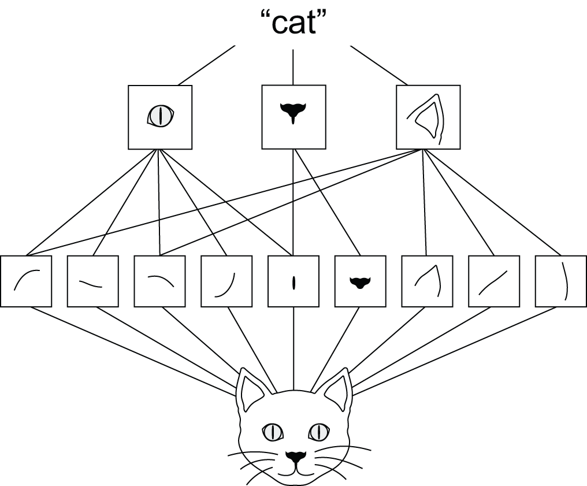
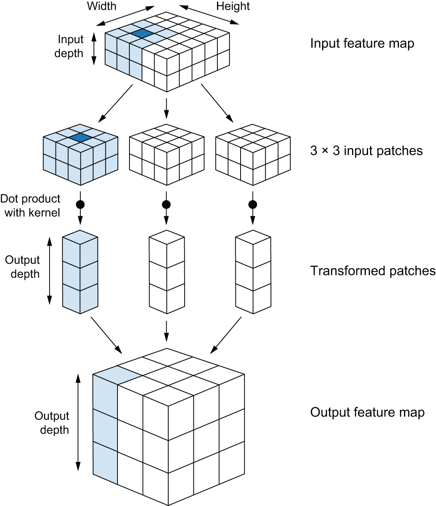
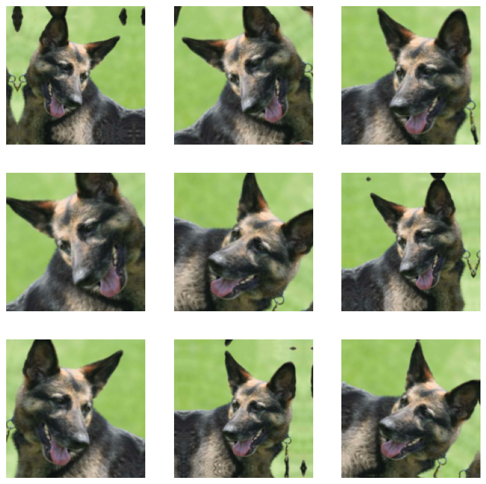
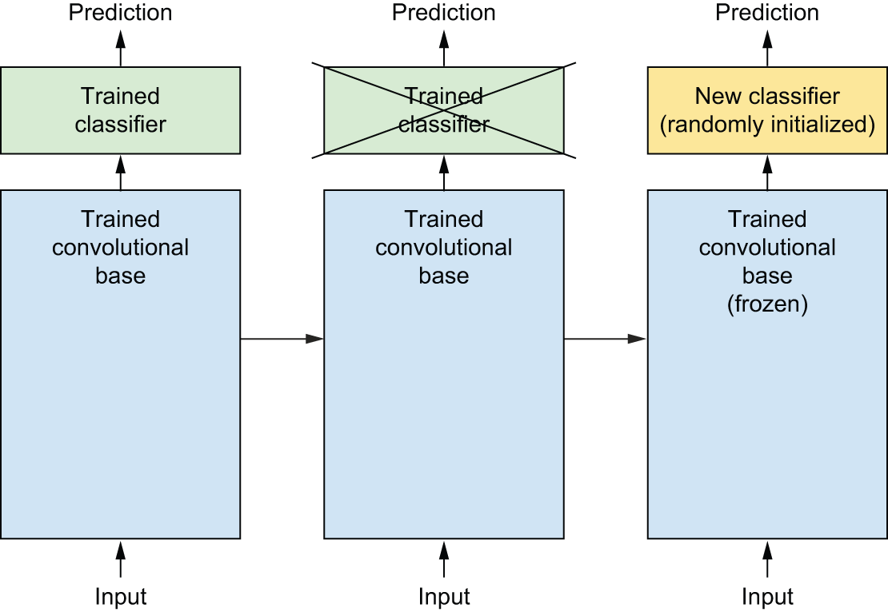

## Learning objectives

-   Explain why convolutional networks match the structure of image data
-   Contrast training from scratch on a small dataset with transfer-learning workflows
-   Name the main levers for small-data image problems (preprocessing, augmentation, pretrained features)

## Why this chapter matters

- Computer vision was an early showcase for deep learning (competitions through the 2010s helped establish CNNs)
- Convolutional neural networks (ConvNets / CNNs) remain the default backbone for many vision pipelines
- Most practitioners face **small or medium** labeled sets, not web-scale data — the chapter centers that reality

::: notes
- Ask the group where they already use vision models (phones, search, medical imaging, etc.).
- Tie to chapter 5: same optimization vs generalization tension, but with inductive biases suited to pixels.
:::

## Dense layers vs convolutions on images

- **Dense** layers learn **global** relationships over the whole flattened input
- **Conv** layers learn **local** patterns in small spatial windows, reused everywhere on the grid
- Two consequences the book stresses: **translation invariance** (same motif anywhere on the image) and a **spatial hierarchy** (edges → textures → parts → objects)

{fig-align="center" height="280" fig-alt="Diagram: low-level lines and textures combine into parts such as eyes, then into a high-level cat concept."}

::: notes
- Point at Figure 8.2 (*Deep Learning with Python*, 3e): where does “hierarchy” end and task-specific semantics begin?
- MNIST example in the book: a simple ConvNet beats the chapter 2 dense baseline — why is that a fair comparison of *inductive bias*, not just "more parameters"?
- When might a dense or MLP-style model still be reasonable for images? (tiny images, tabularized patches, etc.)
:::

## Convolution in one pass

- A **kernel** slides over the height–width grid; each location produces one vector of **filter responses**
- Output **depth** = number of filters; each channel is a **feature map** (where that filter fires)
- **Padding** (`valid` vs `same`): control border shrinkage vs keeping spatial size
- **Stride** > 1: skip positions and downsample (common in other architectures; classification stacks often prefer pooling instead)

{fig-align="center" height="300" fig-alt="Illustration of a 3D input patch multiplied by a kernel and assembled into a 2D output feature map."}

::: notes
- Walk through one location in Figure 8.4 (*Deep Learning with Python*, 3e): input patch → output cell.
- Invite someone to whiteboard "same padding" vs "valid" for a 3×3 kernel on a small grid — keep it qualitative.
- Why does sharing one kernel across positions reduce sample complexity compared to learning independent weights per location?
:::

## Max pooling

- Fixed **max** over small windows (often 2×2, stride 2) — halves spatial size per axis, no learned weights inside the pool
- **Downsamples** aggressively so deeper layers see broader context without exploding parameters
- The book contrasts removing pooling: spatial maps stay large and the parameter burden grows

::: notes
- Discuss pooling vs strided conv for downsampling — different inductive bias, both used in practice in modern designs.
- What is max pooling *throwing away* on purpose? (exact location within the window — part of the translation-invariance story)
:::

## Small data: train a ConvNet from scratch

- Deep learning can still help with **limited** labels if you regularize well and use sensible preprocessing
- **Preprocessing** (resize, scale, optional RGB vs grayscale) aligns inputs with how the network was designed to see the world
- Expect modest accuracy from scratch on tiny sets — the chapter uses it to set up stronger tools next

::: notes
- What does "small" mean in your domains? hundreds vs thousands vs tens of thousands of images per class?
- Baselines matter: what would a shallow model or a pretrained linear probe achieve on the same split?
:::

## Data augmentation

- Random transforms at **training** time (flips, rotations, zooms, color jitter, etc.) artificially expand diversity
- Acts as a strong **regularizer**: the network is pushed not to rely on exact pixel placements or lighting
- Must stay **plausible** for the domain — extreme augmentation can introduce off-manifold examples

{fig-align="center" height="340" fig-alt="Grid of many versions of one dog photo with flips, crops, and color jitter applied."}

::: notes
- Figure 8.10 (*Deep Learning with Python*, 3e): which transforms are “obviously safe” for your application domain, which are risky?
- How does augmentation interact with **domain shift** (train photos vs deployment camera)?
- Anyone hit cases where augmentation hurt (text, medical imaging orientation, etc.)?
:::

## Pretrained models: featue extraction

{fig-align="center" height="260" fig-alt="Block diagram: frozen convolutional base feeds into a new dense classifier stack."}

 
- Freeze a trained backbone; train only a small head on your labels
- Fast, low data, good when your task is "close enough" to the pretraining distribution

## Pretrained models: Fine-tuning
- Note this is almost always combined with feature extraction to first train the new laers.
- Unfreeze some top layers (sometimes with a lower learning rate) so representations adapt to your domain
- More data and care needed; risk of overfitting or catastrophic forgetting if done too aggressively

::: notes
- Relate Figure 8.12 to the bullets: frozen blocks vs which layers you unfreeze for fine-tuning.
- When would you *not* start from a pretrained vision model in 2026?
- Compare to chapter 5's themes: early stopping, small heads, and augmentation are all ways to manage capacity vs data.
:::

## Discussion questions

1. The book emphasizes translation invariance and hierarchical features — where do those assumptions fail for problems you care about?
2. For a fixed labeling budget, would you spend effort on **more data**, **better augmentation**, or **a larger pretrained backbone** — and in what order?
3. Fine-tuning unfreezes capacity near the input — what safeguards (smaller LR, fewer layers, frozen BN) matter in your experience or reading?
4. How does the small-data ConvNet story connect back to **evaluation hygiene** from chapter 5 (splits, leakage, baselines)?

::: notes
- Pick 1–2 questions for a timed breakout; reconvene on concrete tradeoffs, not tool names.
- Optional closing: skim the chapter summary bullets and ask "what one thing will you try on your next image project?"
:::
