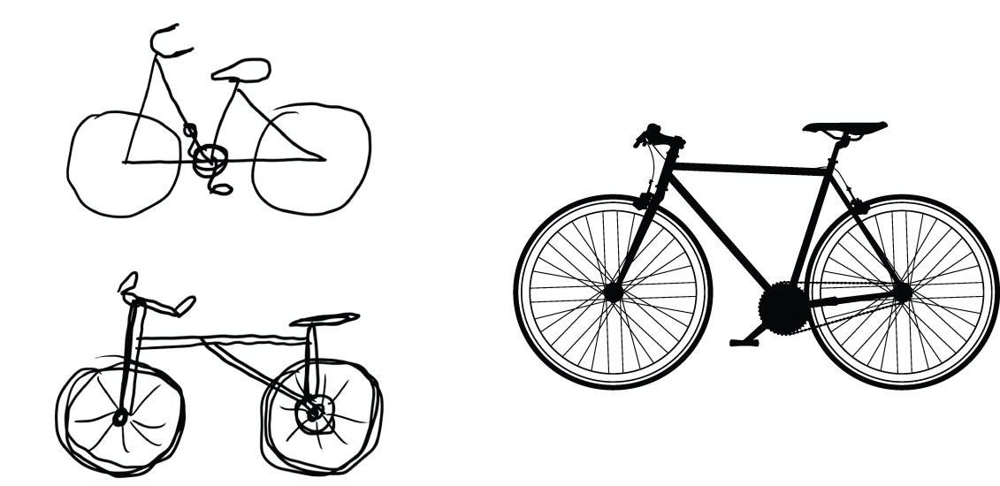
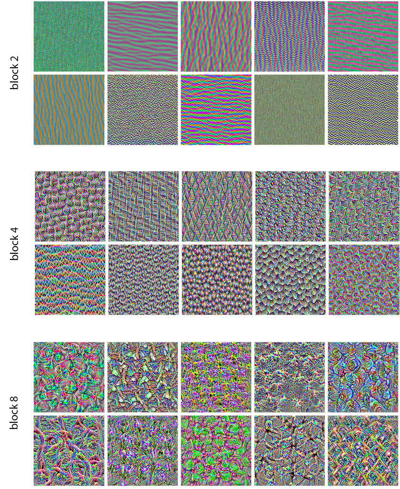
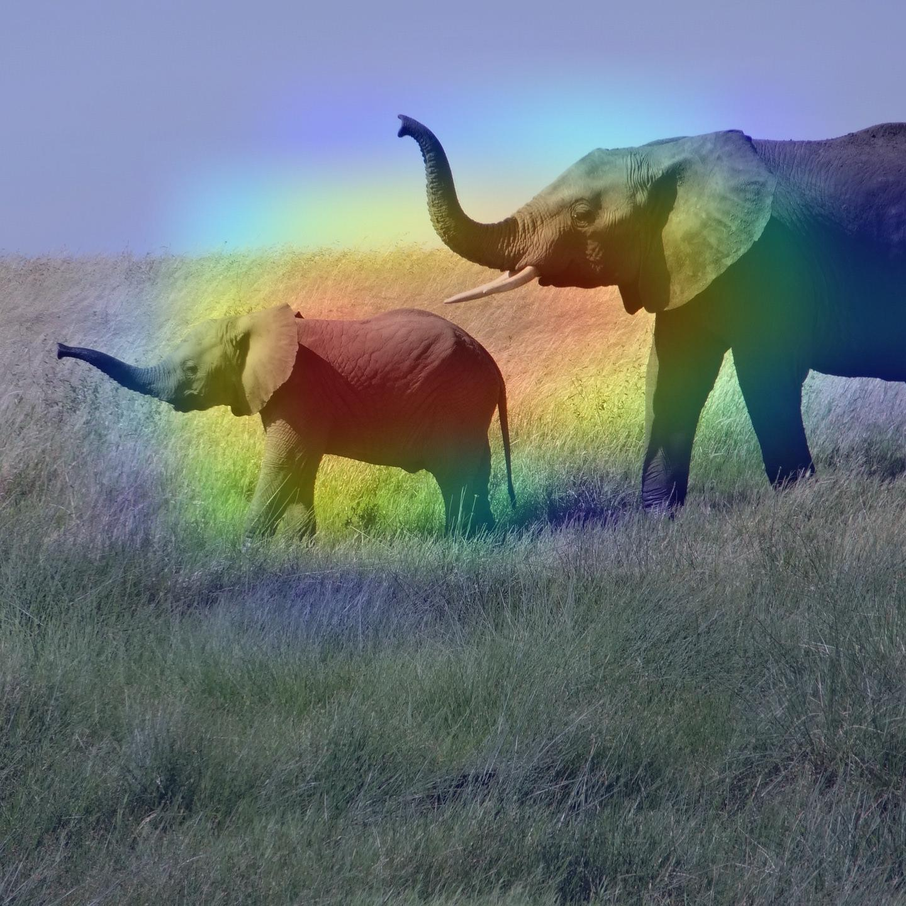

## Learning objectives

-   Visualize intermediate activations to see how ConvNet layers transform an input image
-   Use gradient ascent to visualize the patterns that individual ConvNet filters respond to
-   Use Grad-CAM to identify which image regions contributed to a class prediction

## Why this chapter matters

- Chapter 8 and 9 taught us to build image classifiers; Chapter 10 asks **what did the classifier learn?**
- Interpretability is especially relevant when deep learning complements human expertise, such as medical imaging
- ConvNet representations are visual concepts, so we can often inspect them directly
- The chapter focuses on three accessible techniques for visualizing and interpreting these representations

## Three ways to look inside a ConvNet

| Technique | Question it helps answer |
|:--|:--|
| Intermediate activations | How does this specific input get transformed layer by layer? |
| Filter visualization | What pattern is a particular filter looking for? |
| Grad-CAM / class activation maps | What image regions contributed to this classification? |

## Intermediate activations

- Feed one image through the model and collect outputs from the convolution and pooling layers
- Each activation tensor is a stack of 2D feature maps: one spatial map per channel
- Early layers preserve much of the original image structure
- Later layers become sparser, more abstract, and more class-oriented

## Activations through the network

{fig-align="center" height="520" fig-alt="Grid of activation channels across successive convolution and pooling layers, becoming more sparse and abstract with depth."}

:::: notes
- Point out visual recognizability, sparsity, and class relevance as the activations get deeper.
::::

## Information distillation

- ConvNets repeatedly transform the input: pixels → edges/textures → parts → task-relevant concepts
- Deeper layers discard details that are irrelevant to the training objective
- This is why a high-level representation may be excellent for classification and poor for reconstruction
- The model is not preserving the image; it is preserving what helps solve the task

## The bicycle memory analogy

{fig-align="center" height="430" fig-alt="Hand-drawn attempts to draw bicycles from memory next to a correct schematic bicycle."}

## Filter visualization

- Instead of asking "what activates on this image?", ask "what image would maximally activate this filter?"
- Start from random noise and use gradient ascent on the input image
- The result is a synthetic pattern the filter responds to strongly
- Earlier filters tend to look like edges and colors; later filters look like textures or object-like fragments

## Filters across layers

{fig-align="center" height="500" fig-alt="Grids of synthetic filter patterns showing simple early-layer patterns and more complex texture-like patterns in later layers."}

## Gradient ascent in input space

The recipe:

1. Choose a layer and filter
2. Define a loss: the mean activation of that filter
3. Compute gradients of the loss with respect to the input image
4. Update the image to increase the filter activation
5. Post-process the result into something viewable

## Grad-CAM

- Grad-CAM produces a heatmap for a particular class prediction
- It weights the last convolutional feature *maps* by how important each channel is to the target class
- The heatmap answers: **where did the model find evidence for this class?**
- Useful for debugging classification mistakes and localizing objects in images

## Grad-CAM overlay

{fig-align="center" height="480" fig-alt="An elephant photo with a colored Grad-CAM heatmap highlighting regions that contributed to the African elephant prediction."}

## What Grad-CAM is doing

| Step | Intuition |
|:--|:--|
| Get final conv-layer feature maps | Preserve rough spatial layout for visualization |
| Compute gradients for the target class | Measure which *channels* matter for the class |
| Weight feature maps by those gradients | Keep evidence relevant to the decision |
| Average, keep positive values, and normalize | Produce a 2D heatmap for visualization |

:::: notes
If asked *why gradients indicate importance*: the gradient of the class score with respect to a feature map answers "if this channel were slightly more active, would the class score go up?"
More precisely, to first order $y_c \approx \text{const} + \text{gradient} \cdot \text{activation}$, so the gradient tells us which activations contribute to the classification.
::::

## Takeaways

- **ConvNets learn a hierarchy**: pixels → edges/textures → parts → task-relevant concepts
- **Three complementary lenses** let us inspect that hierarchy:
    - Activations show *how one input flows* through the network
    - Filter visualizations show *what each unit is tuned to*
    - Grad-CAM shows *where evidence for a class lives* in the image
- Deep representations are **shaped by the task**, not by the image — the bicycle drawings are us, too

:::: notes
Good place to invite the room: which of these would you actually reach for first on your own models, and why?
::::
