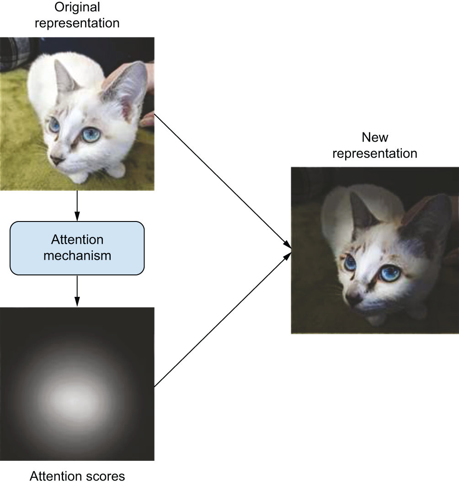

## Learning objectives

-   Explain what a language model predicts and how autoregressive generation works
-   Describe the encoder–decoder setup for sequence-to-sequence problems like translation
-   Explain attention (query, key, value) and why Transformers replace RNN loops
-   Understand positional embeddings, causal masking, and pretrained Transformer fine-tuning

## Why this chapter matters

- Chapter 14 handled **text in** (tokenization, embeddings, classification)
- Chapter 15 handles **text out** — generation, translation, and the architecture behind modern LLMs
- The Transformer is the backbone of ChatGPT, BERT, RoBERTa, and most NLP since 2017
- This chapter connects toy examples to **pretrained models at scale**

## From classification to generation

| Task | Output |
|:--|:--|
| Binary classification | One number |
| N-way classification | N numbers |
| Language modeling | A **sequence** of tokens, one step at a time |

- You cannot classify over all possible output sequences — the space is astronomically large
- Instead, learn **p(token | past tokens)** and generate by repeating that prediction

## The language model setup

- Predict **one token at a time** from everything seen so far
- Vocabulary of 20,000 words → only 20,000 outputs per step
- Loop the model: predicted token becomes the next input (**autoregressive**)
- Training is still classification — but inference needs a **custom generation loop**

## Shakespeare: character-level LM

- Download Shakespeare text; chunk into **100-character** sequences
- Labels are the input shifted by one character
- **Character-level** `TextVectorization` → vocabulary of only **67** characters
- Model: `Embedding` → `GRU` (1024 hidden) → `Dense` softmax over characters

## Training vs generation

| Phase | What happens |
|:--|:--|
| Training | Fixed 100-token sequences; GRU state handled inside the layer |
| Generation | One character at a time; **explicit GRU state** passed between calls |

- Build a separate `generation_model` with `return_state=True` and copy weights
- **Prime** the state by feeding the prompt character by character
- Then loop: argmax → feed back → update state

## Do not cheat with bidirectional RNNs

- Replacing `GRU` with `Bidirectional(GRU)` during LM training → accuracy shoots above 99%
- Generation **breaks completely**
- During training the model sees the full sequence; bidirectional layers leak **future** tokens
- Language modeling requires **one-directional** information flow

## Sequence-to-sequence learning

{fig-align="center" height="320" fig-alt="Diagram showing an encoder turning a source sequence into a representation and a decoder predicting the target sequence one token at a time."}

- **Encoder** turns the source sequence into a representation
- **Decoder** predicts the next target token given past target tokens + encoder output
- At inference: encode once, then autoregressively decode from `[start]` until `[end]`

## English-to-Spanish translation data

- spa-eng dataset: English tab Spanish per line
- Spanish wrapped with `[start]` … `[end]` tokens
- Separate `TextVectorization` layers for each language (15,000 vocab, length 20)
- Custom standardization preserves `[start]`/`[end]` and strips Spanish `¿`
- `sample_weights` mask padded label positions in the loss

## Naive RNN translation fails

- Predicting target token N from only source tokens 0…N cannot work
- Spanish word order often depends on **end** of the English sentence
- Human translators read the **whole** source sentence first

## Encoder–decoder RNN

{fig-align="center" height="300" fig-alt="Diagram of a bidirectional GRU encoder feeding its state into a unidirectional GRU decoder for translation."}

- **Encoder**: `Bidirectional(GRU)` — rich source representation (no cheating; not predicting tokens)
- **Decoder**: unidirectional `GRU` with `initial_state=encoder_output`
- ~35M parameters; ~65% next-token accuracy on validation after 15 epochs
- Next-token accuracy is a **crude** metric; BLEU is standard for real MT systems

## RNN seq2seq limitations

- Entire source must fit in one **fixed-size state vector**
- Long sequences: RNNs **forget** early tokens
- Inference is inefficient — reprocesses full source and target each step
- Google Translate circa 2017 used a **stack of 7 LSTMs** in a similar setup

## Timing: Colab T4 (cheapest tier)

| Example | Total time | Per step |
|:--|:--|:--|
| Shakespeare char LM | ~4 min | ~80 ms/step |
| Spanish RNN translation | ~28 min | ~90 ms/step |

- Shakespeare is small (~4M params, char-level, short sequences) — trains fast even on a T4
- RNN translation is ~35M params with bidirectional encoding — noticeably slower per epoch

 

## What is attention?

{fig-align="center" height="260" fig-alt="Diagram showing input features receiving attention scores that weight their contribution to the next representation."}

- RNNs pass all information through a **sequential loop** — like reading a book once and implementing from memory
- Attention lets the model **look back** at any position in the source, weighted by relevance
- Developed to help RNNs with long-range dependencies; then researchers asked: **attention only?**

## Dot-product attention

- Score each source position against the current target position
- `softmax` scores → weighted sum of source vectors
- Dot-product: vectors that are **close** in embedding space score higher
- Standard names: **query** (what we need), **key** (what we match against), **value** (what we retrieve)

## Multi-head attention

{fig-align="center" height="300" fig-alt="Diagram showing multiple attention heads each producing different weighted combinations of source tokens."}

- Project query, key, value with separate `Dense` layers (learnable)
- Scale scores by `sqrt(head_dim)` for stable softmax gradients
- **Multiple heads** avoid washing out individual tokens in one big softmax sum
- Keras: `layers.MultiHeadAttention(num_heads, head_dim)`

## Transformer encoder block

- **Self-attention** on the source sequence (each token attends to all tokens)
- **Feedforward** sublayer: two `Dense` layers with ReLU — adds nonlinearity attention alone lacks
- **Residual connections** + **LayerNormalization** after each sublayer
- `LayerNormalization` pools over features **within each sequence** (not across the batch like `BatchNorm`)
- `attention_mask` excludes padding tokens

## Transformer decoder block

- **Self-attention** with **causal mask** (`use_causal_mask=True`) — no peeking at future target tokens
- **Cross-attention** — target queries attend to encoder keys/values
- Same feedforward + residual + layernorm pattern as the encoder
- Causal mask = lower-triangular: position *i* sees tokens 0…*i* only

## Transformer blocks stacked

{fig-align="center" height="360" fig-alt="Diagram of stacked self-attention, cross-attention, and feedforward sublayers in encoder and decoder blocks."}

## First Transformer attempt: missing position

- Replacing GRUs with `TransformerEncoder` + `TransformerDecoder` → only ~58% accuracy
- **Problem**: attention is a **set** operation — permute token order, get the same result
- Without position info, the model is not truly sequence-aware
- Fix: add **positional embeddings** (learned position vectors added to token embeddings)

## Transformer with positional embeddings

- `PositionalEmbedding`: token embedding + position embedding (learned)
- ~14M parameters (about **half** the RNN model)
- ~67% next-token accuracy after 30 epochs — beats the GRU
- Training is **faster per epoch** — no sequential RNN loop; attention is parallel on GPU/TPU
- Subjective translation quality is noticeably better

## Pretrained Transformers: BERT and RoBERTa

| Model | Idea |
|:--|:--|
| BERT | Masked language modeling — predict masked tokens from **surrounding** context |
| RoBERTa | Same encoder architecture; **more pretraining data** (160 GB vs 16 GB) |

- **Encoder-only**, bidirectional — great for representations, not autoregressive generation
- Pretraining cost: RoBERTa estimated at **hundreds of thousands of dollars**
- Shift in NLP: train huge models once, **fine-tune** on small labeled tasks

## RoBERTa + KerasHub on IMDb

- `keras_hub`: `Tokenizer.from_preset("roberta_base_en")` + `Backbone.from_preset(...)`
- Subword tokenizer (~50k vocab) — handles open vocabulary without huge embedding tables
- Backbone: 12 stacked Transformer encoder layers, **124M parameters**, 768-dim outputs
- Classification head: use **first token** representation (`x[:, 0, :]`) → dense → sigmoid
- One epoch fine-tuning → **~94%** test accuracy (vs ~90% ceiling in chapter 14)

##   Timing: Modal A10G (32 GB, 2 cores)

| Example | Total time | Per step |
|:--|:--|:--|
| Spanish Transformer (with positional embeddings) | ~6 min | ~6 ms/step |
| IMDb RoBERTa fine-tuning (transfer learning) | ~6 min | ~254 ms/step |

- Transformer translation on A10G: ~**15× faster per step** than RNN on Colab T4 (6 ms vs 90 ms)
- IMDb fine-tuning is fewer steps but heavier per step (124M-param backbone, 512-token sequences)
 

## What makes the Transformer effective?

- Connection to **Word2Vec**: tokens that co-occur end up **close** in embedding space
- Attention **recombines** embeddings, weighting tokens already close (high dot-product)
- Embedding spaces are **semantically continuous** and **interpolative**
- Large Transformers store complex **vector programs**, not just simple arithmetic like `king - man + woman ≈ queen`
- Interpolation enables generalization — and **hallucination**

## Practical model choice

| Situation | Likely approach |
|:--|:--|
| Toy text generation / learning | Char- or word-level LM with GRU |
| Custom translation (small data) | Transformer seq2seq + positional embeddings |
| Real translation / QA at scale | Pretrained seq2seq or LLM |
| Classification with limited labels | Pretrained encoder (RoBERTa, BERT) + fine-tune |
| Cutting-edge generation | Large causal LM (chapter 16) |

## Takeaways

- Language models learn **p(token | past tokens)**; generation is an inference-time loop
- Seq2seq = **encoder** (source) + **decoder** (autoregressive target)
- **Attention** replaces RNN state loops with direct, context-dependent lookups
- Transformers need **positional embeddings** and **causal masking** in the decoder
- Pretrained Transformers + fine-tuning is the default for real NLP work
- Hardware matters: parallel attention rewards modern GPUs; RNN translation can be painfully slow

:::: notes
Good closing prompt: after chapters 14–15, you can classify text, generate Shakespeare, translate sentences, and fine-tune RoBERTa. Which of these feels closest to something you would use at work?
::::
