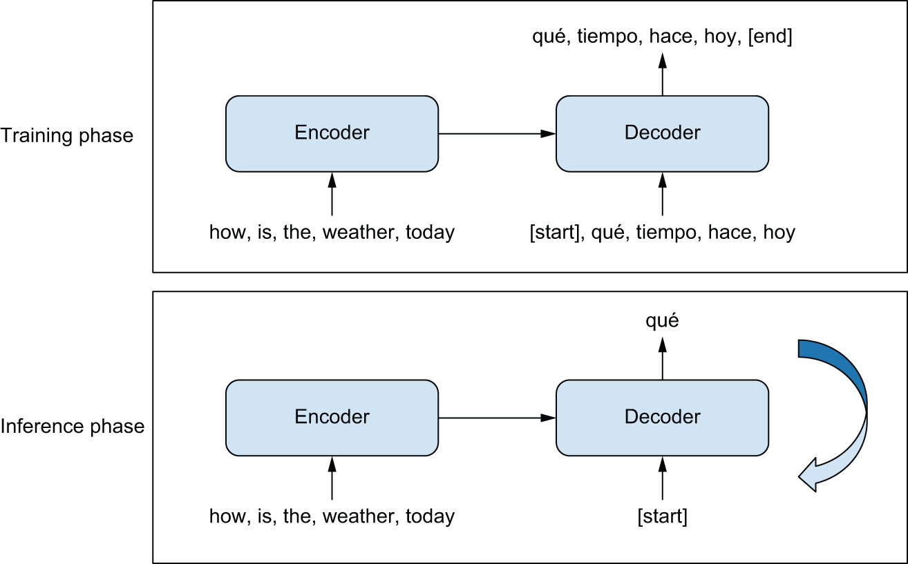
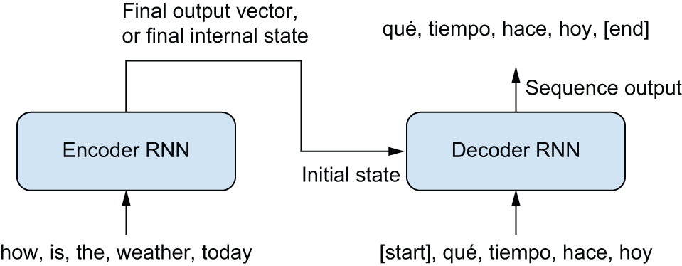
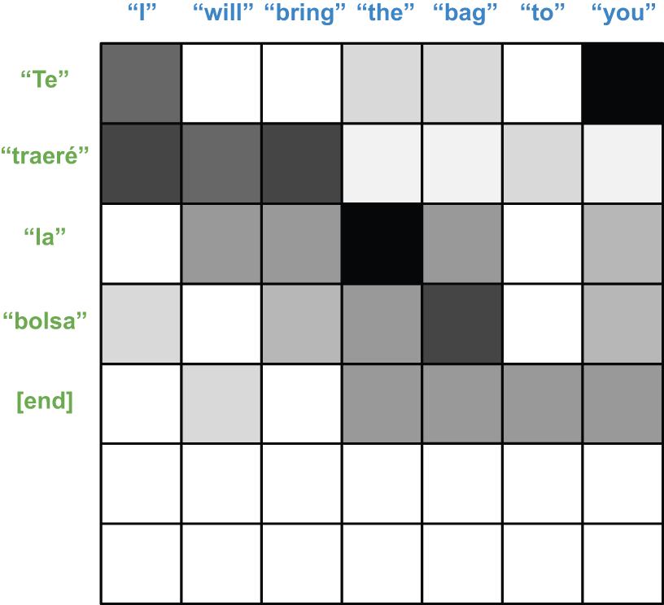
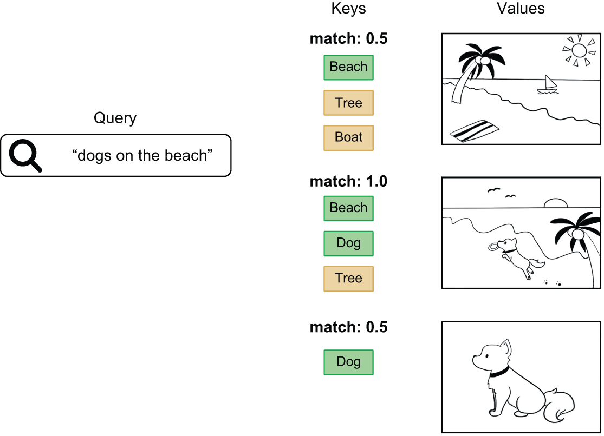
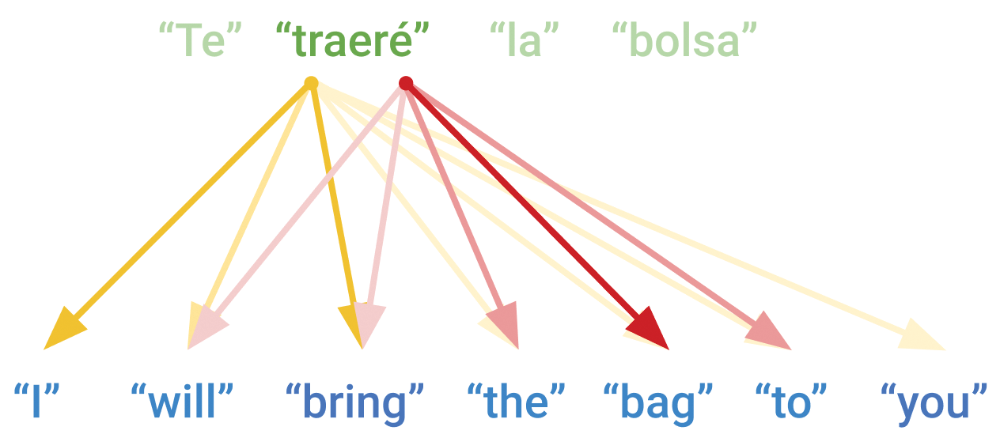
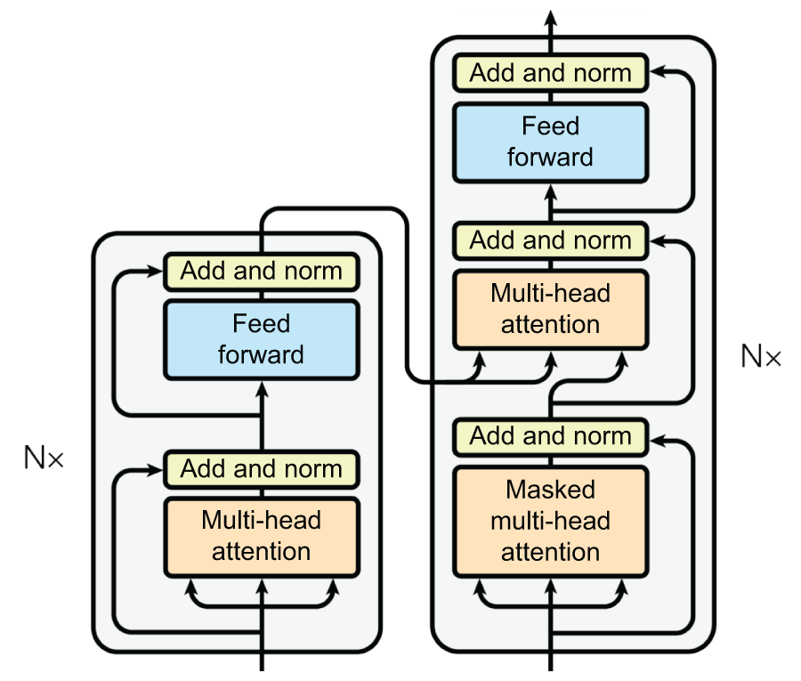

## Learning objectives

-   Explain what a language model predicts and how autoregressive generation works
-   Describe the encoder–decoder setup for sequence-to-sequence problems like translation
-   Explain attention (query, key, value) and why Transformers replace RNN loops
-   Understand positional embeddings, causal masking, and pretrained Transformer fine-tuning

## Why this chapter matters

- Chapter 14 handled **text in** (tokenization, embeddings, classification)
- Chapter 15 handles **text out** — generation, translation, and the architecture behind modern LLMs
- The Transformer is the backbone of ChatGPT, BERT, RoBERTa, and most NLP since 2017
- This chapter connects toy examples to **pretrained models at scale**

:::: notes
Opening question: where in your own work is the desired output a **sequence** (text, code, a list of steps) rather than a single label? That is the jump this chapter makes.
::::

## From classification to generation

| Task | Output |
|:--|:--|
| Binary classification | One number |
| N-way classification | N numbers |
| Language modeling | A **sequence** of tokens, one step at a time |

- You cannot classify over all possible output sequences — the space is astronomically large
- Instead, learn **p(token | past tokens)** and generate by repeating that prediction

:::: notes
Check for the group: with a 20,000-word vocabulary, a 20-word sentence has 20,000²⁰ possible values. Factoring the problem into one-token-at-a-time predictions is what makes it tractable.
::::

## The language model setup

- Predict **one token at a time** from everything seen so far
- Vocabulary of 20,000 words → only 20,000 outputs per step
- Loop the model: predicted token becomes the next input (**autoregressive**)
- Training is still classification — but inference needs a **custom generation loop**

## Shakespeare: character-level LM

- Chunk the text into **100-character** sequences; labels are the input shifted by one
- **Character-level** vocabulary → only **67** tokens (no tokenizer headaches)
- Simple model: `Embedding` → `GRU` → `Dense` softmax over characters
- Trains to ~70% next-char accuracy — enough to babble in Shakespearean style

## Training vs generation

The same weights, two very different runtimes:

| Phase | What happens |
|:--|:--|
| Training | Fixed 100-token sequences; GRU state handled **inside** the layer |
| Generation | One character at a time; GRU state passed **explicitly** between calls |

- Generation needs a separate model with `return_state=True`, primed on the prompt, then looped

:::: notes
The interesting bit isn't the layer config — it's *why* generation can't reuse the training model as-is. Training sees whole sequences at once; generation has to carry state forward one step at a time. Also worth flagging: the chapter always picks the single highest-probability token (greedy `argmax`) — no temperature, sampling, or beam search. That's a natural lead-in to the sampling strategies in Chapter 16.
::::

## English-to-Spanish translation data

- New task: map a **source** sequence to a **target** sequence (English → Spanish)
- Training Data: ~118k English–Spanish sentence pairs; separate vectorizers per language
- Padding detail: `sample_weights` mask padded positions so padding doesn't pollute the loss

## Naive RNN translation fails

- Predicting target token N from only source tokens 0…N cannot work
- Spanish word order often depends on **end** of the English sentence
- Human translators read the **whole** source sentence first

:::: notes
The human-translator analogy is the whole motivation for the encoder: you read the entire source before you start writing the target. Ask the group for a sentence where you genuinely can't translate the first word until you've seen the last one.
::::

## Sequence-to-sequence learning

{fig-align="center" height="440" fig-alt="Diagram showing an encoder turning a source sequence into a representation and a decoder predicting the target sequence one token at a time."}

**Encoder** reads entire source; **decoder** generates from `[start]` to `[end]` {.smaller}

## Encoder–decoder RNN

{fig-align="center" height="300" fig-alt="Diagram of a bidirectional GRU encoder feeding its state into a unidirectional GRU decoder for translation."}

- **Encoder**: `Bidirectional(GRU)` — rich source representation
- **Decoder**: unidirectional `GRU` with `initial_state=encoder_output`
- ~35M parameters; ~65% next-token accuracy on validation after 15 epochs

## RNN seq2seq limitations

- Entire source must fit in one **fixed-size state vector**
- Long sequences: RNNs **forget** early tokens
- Inference is inefficient — reprocesses full source and target each step
- Google Translate circa 2017 used a **stack of 7 LSTMs** in a similar setup

## Timing: Colab T4 (cheapest tier)

| Example | Total time | Per step |
|:--|:--|:--|
| Shakespeare char LM | ~4 min | ~80 ms/step |
| Spanish RNN translation | ~28 min | ~90 ms/step |

- Shakespeare is small (~4M params, char-level, short sequences) — trains fast even on a T4
- RNN translation is ~35M params with bidirectional encoding — noticeably slower per epoch

 

## What is attention?

- RNNs pass all information through a **sequential loop** — like reading a book once and implementing from memory
- Attention lets the model **look back** at any position in the source, weighted by relevance
- Developed to help RNNs with long-range dependencies; then researchers asked: **attention only?**

## Dot-product attention

{fig-align="center" height="300" fig-alt="A 2D matrix of attention scores; each row corresponds to a target word and shows how strongly it attends to each source word."}

- Score each source position against the current target position, `softmax`, then take a **weighted sum** of source vectors
- Dot-product: vectors that are **close** in embedding space score higher
- No learned parameters yet — just "what's relevant to what"

## Query, key, value: attention as lookup

{fig-align="center" height="280" fig-alt="Diagram of a search/database lookup where a query is matched against keys and the scores are used to retrieve weighted values."}

- Borrowed from search engines: **query** = what you're looking for, **keys** = what's indexed, **values** = what you retrieve
- Dot-product(query, key) = a **relevance score**; softmax turns scores into retrieval weights
- Make Q, K, V each a learned `Dense` projection → attention becomes trainable

:::: notes
This analogy is the unlock for the whole chapter. A web search: your query is matched against indexed keys, and the best-matching pages (values) come back ranked. Self-attention is the same lookup, run with every token as a query against every token as a key. Worth spending real discussion time here.
::::

## Multi-head attention

{fig-align="center" height="300" fig-alt="Diagram showing multiple attention heads each producing different weighted combinations of source tokens."}

- Run several attention "heads" in parallel, each with its **own** Q/K/V projections
- Each head can specialize — one tracks subject–verb, another tracks adjacent words
- Scale scores by `sqrt(head_dim)` for stable softmax gradients
- Keras: `layers.MultiHeadAttention(num_heads, head_dim)`

:::: notes
Discussion: why split into multiple heads instead of one big softmax? A single attention pattern averages everything together and washes out individual relationships. Separate heads let the model attend to several kinds of relationship at once — the same reason a ConvNet uses many filters per layer.
::::

## Transformer encoder block

- **Self-attention** on the source sequence (each token attends to all tokens)
- **Feedforward** sublayer: two `Dense` layers with ReLU — adds nonlinearity attention alone lacks
- **Residual connections** + **LayerNormalization** after each sublayer
- `LayerNormalization` pools over features **within each sequence** (not across the batch like `BatchNorm`)
- `attention_mask` excludes padding tokens

## Transformer decoder block

- **Self-attention** with **causal mask** (`use_causal_mask=True`) — no peeking at future target tokens
- **Cross-attention** — target queries attend to encoder keys/values
- Same feedforward + residual + layernorm pattern as the encoder
- Causal mask = lower-triangular: position *i* sees tokens 0…*i* only

:::: notes
Callback: this is the same trap as a bidirectional RNN language model — let a token see the future and you get 99% training accuracy but a model that can't actually generate (the metric looks great; the task is broken). The causal mask is what prevents it. A useful reminder that high accuracy can mean you've leaked the label.
::::

## Transformer blocks stacked

{fig-align="center" height="360" fig-alt="Diagram of stacked self-attention, cross-attention, and feedforward sublayers in encoder and decoder blocks."}

:::: notes
Walk the group through this diagram slowly — it ties the section together. Trace one path: encoder self-attention → the decoder's causal self-attention → cross-attention into the encoder output → feedforward. Note the three distinct places attention shows up.
::::

## First Transformer attempt: missing position

- Replacing GRUs with `TransformerEncoder` + `TransformerDecoder` → only ~58% accuracy
- **Problem**: attention is a **set** operation — permute token order, get the same result
- Without position info, the model is not truly sequence-aware
- Fix: add **positional embeddings** (learned position vectors added to token embeddings)

:::: notes
Key aha of the section: attention sees a **set**, not a sequence — "dog bites man" and "man bites dog" look identical to it. Ask the group why an RNN never had this problem (it processes tokens in order) and what we give up to gain attention's parallelism.
::::

## Transformer with positional embeddings

- `PositionalEmbedding`: token embedding + position embedding (learned)
- ~14M parameters (about **half** the RNN model)
- ~67% next-token accuracy after 30 epochs — beats the GRU
- Training is **faster per epoch** — no sequential RNN loop; attention is parallel on GPU/TPU
- Subjective translation quality is noticeably better

## Pretrained Transformers: BERT and RoBERTa

| Model | Idea |
|:--|:--|
| BERT | Masked language modeling — predict masked tokens from **surrounding** context |
| RoBERTa | Same encoder architecture; **more pretraining data** (160 GB vs 16 GB) |

- **Encoder-only**, bidirectional — great for representations, not autoregressive generation
- Pretraining cost: RoBERTa estimated at **hundreds of thousands of dollars**
- Shift in NLP: train huge models once, **fine-tune** on small labeled tasks

## RoBERTa + KerasHub on IMDb

- `keras_hub`: `Tokenizer.from_preset("roberta_base_en")` + `Backbone.from_preset(...)`
- Subword tokenizer (~50k vocab) — handles open vocabulary without huge embedding tables
- Backbone: 12 stacked Transformer encoder layers, **124M parameters**, 768-dim outputs
- Classification head: use **first token** representation (`x[:, 0, :]`) → dense → sigmoid
- One epoch fine-tuning → **~94%** test accuracy (vs ~90% ceiling in chapter 14)

## Timing: Modal A10G (32 GB, 2 cores)

| Example | Total time | Per step |
|:--|:--|:--|
| Spanish Transformer (with positional embeddings) | ~6 min | ~6 ms/step |
| IMDb RoBERTa fine-tuning (transfer learning) | ~6 min | ~254 ms/step |

- Transformer translation on A10G: ~**15× faster per step** than RNN on Colab T4 (6 ms vs 90 ms)
- IMDb fine-tuning is fewer steps but heavier per step (124M-param backbone, 512-token sequences)
 

## What makes the Transformer effective?

- Connection to **Word2Vec**: tokens that co-occur end up **close** in embedding space
- Like Hebb's rule — *"neurons that fire together wire together"* — correlation becomes geometry
- Small models learn vector **arithmetic** (`king - man + woman ≈ queen`); large ones learn vector **programs**
- Embedding spaces are **semantically continuous** and **interpolative**
- Interpolation enables generalization — and **hallucination**

:::: notes
The richest discussion in the chapter: a Transformer is an *interpolative* database. It can retrieve and blend beyond what it literally stored — that's both generalization and hallucination, two faces of the same mechanism. Prompt: if interpolation is the source of both, can you ever fully remove hallucination without losing generalization?
::::

## Practical model choice

| Situation | Likely approach |
|:--|:--|
| Toy text generation / learning | Char- or word-level LM with GRU |
| Custom translation (small data) | Transformer seq2seq + positional embeddings |
| Real translation / QA at scale | Pretrained seq2seq or LLM |
| Classification with limited labels | Pretrained encoder (RoBERTa, BERT) + fine-tune |
| Cutting-edge generation | Large causal LM (chapter 16) |

## Takeaways

- Language models learn **p(token | past tokens)**; generation is an inference-time loop
- Seq2seq = **encoder** (source) + **decoder** (autoregressive target)
- **Attention** replaces RNN state loops with direct, context-dependent lookups
- Transformers need **positional embeddings** and **causal masking** in the decoder
- Pretrained Transformers + fine-tuning is the default for real NLP work
- Hardware matters: parallel attention rewards modern GPUs; RNN translation can be painfully slow

:::: notes
Good closing prompt: after chapters 14–15, you can classify text, generate Shakespeare, translate sentences, and fine-tune RoBERTa. Which of these feels closest to something you would use at work?
::::
