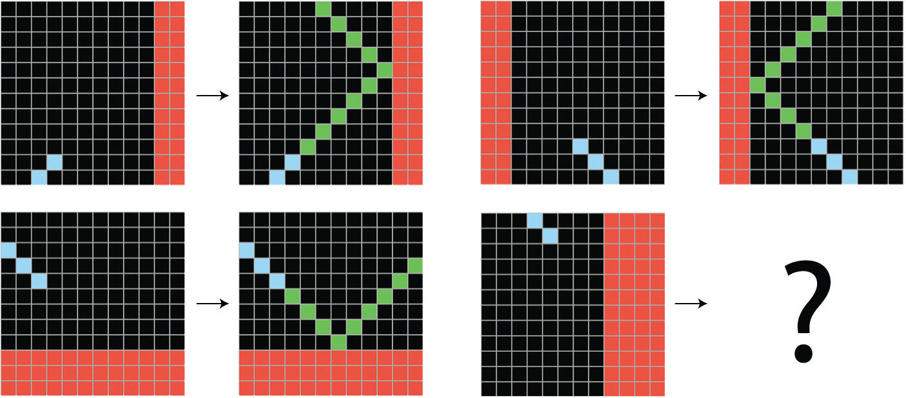

## Wrapping up: three "big picture" chapters

- **Chapter 18: Best practices for the real world**

    What is needed to scale a proof of concept to a real-world model
- **Chapter 19: The future of AI**

    Chollet's argument for what deep learning is and isn't
- **Chapter 20: Conclusions**

    A bird's-eye review of everything, and where to go next
- Less code this week, more **discussion** — this is our last session

:::: notes
Opening prompt for the group: after 20 chapters, what's the one capability you're most likely to actually use at work — and the one idea that most changed how you think about ML? We'll come back to this at the end.
::::


# Chapter 18 · Best Practices for the Real World

## Getting the most out of your models

Squeezing more performance:

- **Hyperparameter tuning** — systematic search
- **Model ensembling** — combine diverse models into one better predictor

Training & serving faster:

- **Parallelize** across multiple devices
- **Lower-precision** computation


## Parameters vs. hyperparameters

| | Set by | Example |
|:--|:--|:--|
| **Parameters** | Backpropagation | Layer weights |
| **Hyperparameters** | Experience and/or search | # units, # layers, learning rate |

- Hyperparameter space is often **discrete and non-differentiable** — no gradient descent
- Need gradient-free search: build → train → measure val → pick next → repeat

## KerasTuner {.smaller}

- Replace hardcoded values with **ranges**:
  - `Int(name="units", min_value=16, max_value=64, step=16)`
  - Also `Float`, `Boolean`, `Choice`
- Wrap your model in a function taking `hp`, or subclass `HyperModel`
- Pick a search strategy:

| Tuner | Idea |
|:--|:--|
| `GridSearch` | Try every combination |
| `RandomSearch` | Sample the space at random |
| `BayesianOptimization` | Balance exploit vs explore |


:::: notes
The mechanics matter less than the mindset: tuning turns "I'll just pick 32 units" into a measured decision. `executions_per_trial` trains each config more than once to average out random-seed variance — worth mentioning why that's needed.
::::


## The validation-set overfitting trap

- Every time you tune on the validation set, you **leak** information about it
- Hyperparameters start to overfit the validation data...
- Defense: keep the **test set** untouched until the very end

:::: notes
This is the same leakage idea from Chapter 5, one level up. First we overfit training data with parameters; now we can overfit validation data with hyperparameters. Ask the group where else this "optimizing on your yardstick" pattern shows up (Goodhart's law — foreshadows the "shortcut rule" in Ch.19).
::::


## Model ensembling

- Pool predictions from **multiple** models 
- "Blind men and the elephant": different models capture different facets

```python
final_preds = 0.25 * (preds_a + preds_b + preds_c + preds_d)   # equal
final_preds = 0.5*preds_a + 0.25*preds_b + 0.15*preds_c + 0.1*preds_d  # learned weights
```

- Weights tuned on validation (random search / Nelder–Mead)


## Diversity beats individual quality

- Retraining the **same** net with new seeds → tiny gains
- Mixing **fundamentally different** methods (trees + neural nets) → big gains
- A weaker model with a *unique perspective* can still help the ensemble
- Example: Chollet's own 4th-place entry in the 2014 Higgs Boson challenge combined tree models (XGBoost) and deep nets
 


## Scaling up: data vs. model parallelism

| Strategy | What's split | When |
|:--|:--|:--|
| **Data parallelism** | The *batch* | Model fits on one device (common case) |
| **Model parallelism** | The *model* | Model too big for one device |

- Data parallel: replicate model, each device gets a sub-batch, **average gradients**
- Model parallel: split layers or split within a layer 
- Can **combine** both (e.g. split across 4 GPUs, replicate ×2 → 8 devices)

 
## Lower precision & mixed precision {.smaller}

| Type | Bits | Resolution |
|:--|:--|:--|
| `float32` | 32 | ~1e-7 (the default) |
| `float16` | 16 | ~1e-3 |
| `bfloat16` | 16 | wider range, coarser |
| `int8` | 8 | integer inference |

- Modern GPUs/TPUs have **dedicated 16-bit hardware** → ~2× faster, half the memory
- But pure float16 **can't** represent the tiny updates gradient descent needs
- **Mixed precision**: compute in float16, store & update weights in float32
- **Loss scaling**: multiply the loss so small gradients don't underflow to zero (`LossScaleOptimizer` auto-tunes it)


## Faster inference: int8 quantization

```python
model.quantize("int8")   # Dense, EinsumDense, Embedding
```

- Convert trained float32 weights → int8 for **deployment**
- Scale into [-127, 127], integer matmul, unscale — only rounding error lost
- Faster than even float16
- (float8 exists too — but only pays off for 5B+ param models on H100s)

:::: notes
This is the "make it real" section: mixed precision for training, int8 for serving. Ask the group who has actually deployed a model and hit latency/cost walls — this is where these knobs earn their keep.
::::


# Chapter 19 · The Future of AI

## The core claim

> Deep learning models are **vast, interpolative databases of patterns** — not reasoning engines.

- They freeze after training: a static chain of continuous geometric transforms
- Brilliant *within* the training distribution; brittle *outside* it
- The rest of the chapter is Chollet's opinion on what that means.

:::: notes
Set expectations: this chapter is opinionated. Chollet is the author of Keras *and* the creator of the ARC benchmark — he has a specific thesis. Worth reading it as a strong argument to engage with, not settled fact. Where do people agree/disagree?
::::


## Limitation 1 — struggle with novelty

- Parameters are frozen; a distribution shift has no recovery mechanism
- In-context "learning" = fetching a **memorized** vector program, not acquiring a new skill
- "10 kg of steel vs 1 kg of feathers?" → "they weigh the same" — pattern-matched to the *memorized* trick question
- Maintenance is whack-a-mole


## Limitation 2 — sensitivity to phrasing

- **Adversarial examples**: an imperceptible pixel change → panda classified as gibbon
- LLMs: rename a variable or tweak a number and performance can **collapse**
- The "Alice in Wonderland" riddle breaks when N and M drift from common values
- "Prompt engineering" = searching for phrasings that *don't* tank performance

:::: notes
Reframe for discussion: "prompt engineering" is often sold as *your model is smarter than you know*. Chollet's read is the opposite — *there's a range of tiny changes that can tank performance, and you're searching to avoid them.* Which framing matches people's real experience?
::::


## Limitation 3 — can't learn general programs

- ~70% accuracy on **digit addition** after millions of examples
- Place-value logic is discrete; continuous geometric transforms are a poor fit
- Most **programs** simply can't be expressed as a smooth manifold

## The anthropomorphizing trap

- We project **theory of mind** onto anything that uses language
- Models lack the sensorimotor grounding behind human understanding

> "Never fall into the trap of believing that neural networks understand the task they perform."


## Local vs. extreme generalization

| | Local generalization | Extreme generalization |
|:--|:--|:--|
| Who | Deep nets | Humans, advanced animals |
| How | Interpolate on the data manifold | Abstraction & reasoning |
| Handles | "Known unknowns" | "Unknown unknowns" |
| Data need | Millions of examples | A handful |

- Humans derive rocket equations; nets need millions of trials and thousands of crashes


## What is intelligence *for*?

> The ability to efficiently use the information at your disposal to produce successful behavior in the face of an **uncertain, ever-changing future**.

- Brains started as **automatons** — reactive if/then programs (insect-like)
- Intelligence evolved to generate behavior **on the fly** for novel situations
- Deep nets are sophisticated automatons → **cognitive automation**, not autonomy

:::: notes
The provocation: calling today's systems "artificial intelligence" is, for Chollet, a *category error* — they're automation. Is that a useful distinction, or moving the goalposts? Good place to let the group push back.
::::


## Setting the wrong target

- **The shortcut rule**: optimize one metric → everything not measured gets ignored
- Netflix Prize: optimized accuracy (RMSE) → winning system too complex to deploy
- Deep Blue "solved" chess while learning **nothing** about human cognition
- By *fixing the task* you remove the need to handle novelty — you remove the need for **intelligence itself**

:::: notes
Tie this back to Chapter 18's validation-overfitting trap and to Goodhart's law. The theme rhymes across the book: the moment a metric becomes the target, it stops measuring what you cared about.
::::


## ARC-AGI: a test you can't study for {.smaller}

{fig-align="center" width="50%"}

- Tasks designed to be **genuinely novel**
- 2024 ARC Prize forced a shift: **"scale is all you need" → "we need on-the-fly recombination"**
- Winners all used **test-time adaptation** (test-time training or search)
- OpenAI o3: **76%** at \$200/task, up to **88%** at huge cost — but *efficiency* is the point

:::: notes
The empirical core of "scale isn't enough": since 2017, ~50,000× more scale moved 2019 ARC-AGI only from 0% → ~10% — same Transformer curve-fitting, same ceiling. Contrast with how fast scale improved *memorization* benchmarks.
::::


## The missing ingredients: search & symbols

| Value-centric abstraction | Program-centric abstraction |
|:--|:--|
| Similarity / distance | Exact structural match |
| Perception, intuition | Reasoning, planning |
| Immediate, fuzzy, approximate | Slow, exact, rigorous |
| Needs lots of data | Works from few examples |
| **Deep learning has this** | **Deep learning lacks this** |

- Human cognition needs **both**; deep learning is "literally missing half"

:::: notes
Concrete anchor: sorting a list. A neural net struggles; ten lines of Python generalize perfectly. Flip it: classifying MNIST by hand-writing rules is misery; manifold-fitting is easy. The two abstraction types are good at *opposite* things — hence the need to blend them.
::::


## The long-term vision

Chollet's sketch of a path to AGI:

1. Models become **programs**, not just geometric transforms
2. **Blend** algorithmic modules (reasoning, search, memory) with geometric ones (intuition) — **grown** by modular synthesis, not hand-coded
3. Discrete **program search** guided by deep-learning "program-space intuition"
4. Result: a perpetually learning meta-system with human-like **extreme generalization** from minimal data — AGI, no dystopia required

:::: notes
Whether or not you buy the roadmap, notice it's *constructive* — it names specific missing pieces (program synthesis, modular reuse, guided search) rather than just "more scale." Discussion: does hybrid neuro-symbolic feel like the future, or like the pendulum swinging back?
::::


## Since the book: is the gap closing? {.smaller}

**Agentic AI & reasoning models** (o-series, extended thinking, tool use, code execution)

- Chain-of-thought is a form of **search**; tool/code calls borrow real **programs**
- Looks like Chollet's "blend of geometric intuition + algorithmic modules"…
- …but as **external scaffolding** around the same LLM core — not a *grown, learned* system

**ARC-AGI keeps moving**

- ARC-AGI-1 (2019) → cracked by o3 + test-time adaptation
- ARC-AGI-2 (2025) → resists brute force; still hard for frontier models
- ARC-AGI-3 (previewed 2025) → interactive, **agentic** tasks — planning over many steps

:::: notes
The payoff question for the group: does agentic AI *validate* Chollet — search and symbols really were the missing pieces, and bolting them on helps — or does it *dodge* him: still an interpolative core with hand-built scaffolding, so his "automaton, not agent" line hasn't budged? And is ARC's versioning "moving the goalposts," or proof that each version was gameable? Let people land their own verdict — this is the live edge of the book.
::::


# Chapter 20 · Conclusions

## What deep learning is

The nested definitions:

- **AI** — automating any human cognitive process
- **Machine learning** — programs learned from data, not written by hand
- **Deep learning** — long chains of geometric transformations in layers
- **Generative AI** — self-supervised models that produce text / images / audio / video

In one line: *sufficiently large parametric models trained with gradient descent* — everything **geometric**: vectorize the data, uncrumple the manifold.

:::: notes
A clean slide to reset vocabulary. What made it all possible: algorithmic advances (backprop → Transformers), internet-scale data, GPUs, and software (CUDA, TF, JAX, PyTorch, Keras). Worth asking the group to place a few familiar systems (a spam filter, a chess engine, ChatGPT, a diffusion model) into these nested circles.
::::


## The universal ML workflow

1. Define the problem & the data
2. Choose a reliable **success metric**
3. Split train / validation / test
4. Vectorize & preprocess
5. Beat a **common-sense baseline**
6. Refine: tune hyperparameters, regularize
7. **Deploy** and monitor

- Golden rule: tune on validation, judge on test

:::: notes
This is the spine of the whole book (Chapter 6). If someone forgets everything else, this list is what to keep. Ask: which step do people actually skip in practice? (Usually the baseline, or the monitoring.)
::::


## The architecture cheat sheet

| Input | Output | Architecture |
|:--|:--|:--|
| Vector data | Class / regression | Dense network |
| Timeseries | Class / regression | RNN or Transformer |
| Images | Class / regression | ConvNet |
| Text | Class / regression | Transformer |
| Text + images | Text | Transformer |
| Text + images | Images | VAE or Diffusion |

:::: notes
A nice "what did we actually cover" moment — nearly every row maps to a chapter and a past slide deck. Good place to poll which architecture each person found most useful.
::::


## Staying up to date

- **Kaggle** — practice on live problems; ensembles and real data
- **arXiv** — read preprints; track authors via Google Scholar
- **Keras ecosystem** — keras.io docs, code examples, source

> Learning is a lifelong journey — especially in AI, where the unknowns still vastly outnumber the certainties.

 
:::: notes
Closing prompt — bring it back to the opening question: over 20 chapters, what will you actually use, and what most changed your mental model? And after Chapter 19: are you more optimistic or more skeptical about the path to real intelligence than when we started?
::::
